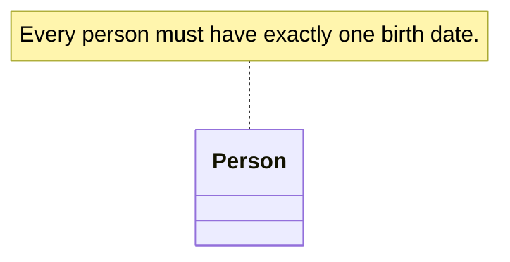

# Anchor

A model element that connects a [note](./note.md) to the model element it concerns.

| Property | Type | Description |
| --- | --- | --- |
| `type` | `"Anchor"` | Discriminator. |
| `note` | `id` | The note the anchor connects. |
| `element` | `id` | The model element the note is about. |

`Anchor` also carries the [properties common to all model elements](./index.md).

The example below connects `note_1` to the class `Person`; the anchor is the dashed line drawn
between the note and the class it annotates.



```json
{
  "type": "Anchor",
  "id": "anchor_1",
  "name": null,
  "note": "note_1",
  "element": "class_person",
  "customProperties": null,
  "created": "2024-09-04",
  "modified": null,
  "alternativeNames": [],
  "description": null,
  "editorialNotes": [],
  "creators": [],
  "contributors": []
}
```
