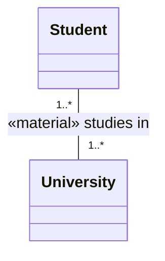
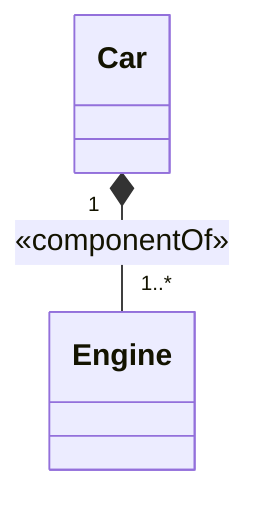

# Binary Relation

A **relation between two members**. It may connect two classes, or — for *derivation* relations — a
relation (as source) and a class (as target), as in the derivation between the material relation
`studies in` and the `Enrollment` relator.

| Property | Type | Description |
| --- | --- | --- |
| `type` | `"BinaryRelation"` | Discriminator. |

`BinaryRelation` carries the properties of [`Classifier`](./classifier.md) (`isAbstract`,
`properties`), [`Decoratable`](./decoratable.md) (`stereotype`, `isDerived`), and the
[properties common to all model elements](./index.md). A binary relation's two ends are
[`Property`](./property.md) elements referenced, **in order**, from its `properties` array
(inherited from `Classifier`).

The example below is the `«material» studies in` relation connecting the classes `Student` and
`University`. Its two ends — the `Property` elements listed in `properties` — are drawn with their
cardinalities (`1..*` at each end).



```json
{
  "type": "BinaryRelation",
  "id": "relation_1",
  "name": { "en": "studies in" },
  "stereotype": "material",
  "isDerived": false,
  "isAbstract": false,
  "properties": ["end_source", "end_target"],
  "customProperties": null,
  "created": "2024-09-04",
  "modified": null,
  "alternativeNames": [],
  "description": null,
  "editorialNotes": [],
  "creators": [],
  "contributors": []
}
```

The ends themselves are separate [`Property`](./property.md) objects, listed elsewhere in the
document and referenced by id from `properties`. Each end carries the cardinality drawn on the
diagram and points, via `propertyType`, to the class it connects — `end_source` to `Student` and
`end_target` to `University`.

```json
{
  "type": "Property",
  "id": "end_source",
  "name": null,
  "stereotype": null,
  "isDerived": false,
  "propertyType": "class_student",
  "cardinality": "1..*",
  "aggregationKind": null,
  "isOrdered": false,
  "isReadOnly": false,
  "subsettedProperties": [],
  "redefinedProperties": [],
  "customProperties": null,
  "created": "2024-09-04",
  "modified": null,
  "alternativeNames": [],
  "description": null,
  "editorialNotes": [],
  "creators": [],
  "contributors": []
}
```

```json
{
  "type": "Property",
  "id": "end_target",
  "name": null,
  "stereotype": null,
  "isDerived": false,
  "propertyType": "class_university",
  "cardinality": "1..*",
  "aggregationKind": null,
  "isOrdered": false,
  "isReadOnly": false,
  "subsettedProperties": [],
  "redefinedProperties": [],
  "customProperties": null,
  "created": "2024-09-04",
  "modified": null,
  "alternativeNames": [],
  "description": null,
  "editorialNotes": [],
  "creators": [],
  "contributors": []
}
```

## Parthood and aggregation {#parthood}

Parthood relations record which end is the **whole** through the `aggregationKind` of that end. The
example below is a `«componentOf»` relation between the whole `Car` and its part `Engine`. In UML it
is drawn with a filled diamond at the whole end.



```json
{
  "type": "BinaryRelation",
  "id": "relation_3",
  "name": null,
  "stereotype": "componentOf",
  "isDerived": false,
  "isAbstract": false,
  "properties": ["end_car", "end_engine"],
  "customProperties": null,
  "created": "2024-09-04",
  "modified": null,
  "alternativeNames": [],
  "description": null,
  "editorialNotes": [],
  "creators": [],
  "contributors": []
}
```

The whole end (`end_car`) sets `aggregationKind` to `"COMPOSITE"` — the filled diamond. The part end
(`end_engine`) illustrates two further flags: `isOrdered` (the order of a car's engines is
meaningful) and `isReadOnly` (an engine cannot be reassigned to another car once linked).

```json
{
  "type": "Property",
  "id": "end_car",
  "name": null,
  "stereotype": null,
  "isDerived": false,
  "propertyType": "class_car",
  "cardinality": "1",
  "aggregationKind": "COMPOSITE",
  "isOrdered": false,
  "isReadOnly": false,
  "subsettedProperties": [],
  "redefinedProperties": [],
  "customProperties": null,
  "created": "2024-09-04",
  "modified": null,
  "alternativeNames": [],
  "description": null,
  "editorialNotes": [],
  "creators": [],
  "contributors": []
}
```

```json
{
  "type": "Property",
  "id": "end_engine",
  "name": null,
  "stereotype": null,
  "isDerived": false,
  "propertyType": "class_engine",
  "cardinality": "1..*",
  "aggregationKind": "NONE",
  "isOrdered": true,
  "isReadOnly": true,
  "subsettedProperties": [],
  "redefinedProperties": [],
  "customProperties": null,
  "created": "2024-09-04",
  "modified": null,
  "alternativeNames": [],
  "description": null,
  "editorialNotes": [],
  "creators": [],
  "contributors": []
}
```
