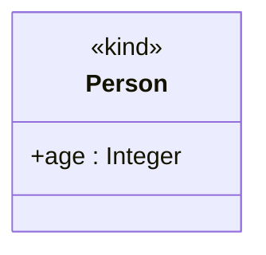

# Class

A **classifier** that defines the properties of a set of individualized (non-relational) entities
of the subject domain — for example `Person`, `Enrollment`, or `Grade`. Its instances may be
objects, reified properties, or bare values.

| Property | Type | Description |
| --- | --- | --- |
| `type` | `"Class"` | Discriminator. |
| `literals` | `id[]` | The [literals](./literal.md) of an enumeration class. |
| `restrictedTo` | `string[]` | The possible ontological natures of the class's instances (see values below). |
| `isPowertype` | `boolean` or `null` | Whether the (high-order) class is a Cardelli powertype. |
| `order` | `string` or `null` | The instantiation order: `"1"` (first-order), `"2"`, `"3"`, … or `"*"` (orderless). |

`Class` also carries the properties of [`Classifier`](./index.md#classifiers-and-properties)
(`isAbstract`, `properties`), [`Decoratable`](./index.md#classifiers-and-properties)
(`stereotype`, `isDerived`), and the [properties common to all model elements](./index.md).

The values allowed in `restrictedTo` are: `abstract`, `collective`, `event`, `extrinsic-mode`,
`functional-complex`, `intrinsic-mode`, `quality`, `quantity`, `relator`, `situation`, and `type` —
see [Ontological Nature](../enumerations/ontological-nature.md) for what each denotes and the named
nature subsets.

When present, `order` must match the pattern `^(\d+|\*)$` — a positive integer such as `"1"` or
`"2"`, or `"*"` for an orderless class.

The example below is the `«kind» Person` class with a single attribute, `age`.



```json
{
  "type": "Class",
  "id": "class_1",
  "name": { "en": "Person" },
  "stereotype": "kind",
  "isDerived": false,
  "isAbstract": false,
  "properties": ["prop_age"],
  "literals": [],
  "restrictedTo": ["functional-complex"],
  "isPowertype": false,
  "order": "1",
  "customProperties": null,
  "created": "2024-09-04",
  "modified": null,
  "alternativeNames": [],
  "description": null,
  "editorialNotes": [],
  "creators": [],
  "contributors": []
}
```
