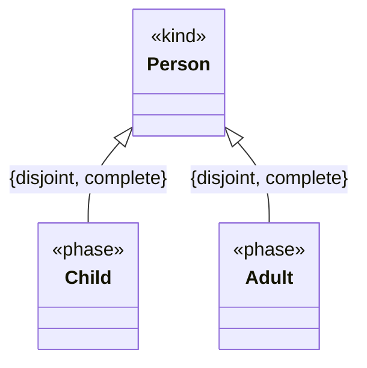

# Generalization set

A model element that groups connected [generalizations](./generalization.md) that share a common
general classifier, optionally constraining them as disjoint and/or complete. For example, the
disjoint and complete generalization set of `Person` into `Child` and `Adult`.

| Property | Type | Description |
| --- | --- | --- |
| `type` | `"GeneralizationSet"` | Discriminator. |
| `isDisjoint` | `boolean` or `null` | Whether the specific classifiers have disjoint extensions (no shared instances). |
| `isComplete` | `boolean` or `null` | Whether the specific classifiers completely cover the general classifier's extension. |
| `generalizations` | `id[]` | The generalizations grouped by the set. |
| `categorizer` | `id` or `null` | The high-order class whose instances are the specific classes in the set. Only valid for sets involving exclusively classes. |

`GeneralizationSet` also carries the [properties common to all model elements](./index.md).

The example below groups the two generalizations of `Person` into `Child` and `Adult` as a
`{disjoint, complete}` set — the UML constraint shown next to the shared generalization arrows.



```json
{
  "type": "GeneralizationSet",
  "id": "genset_1",
  "name": { "en": "by age" },
  "isDisjoint": true,
  "isComplete": true,
  "generalizations": ["gen_child", "gen_adult"],
  "categorizer": null,
  "customProperties": null,
  "created": "2024-09-04",
  "modified": null,
  "alternativeNames": [],
  "description": null,
  "editorialNotes": [],
  "creators": [],
  "contributors": []
}
```
