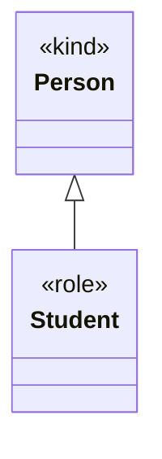

# Generalization

A model element that represents the generalization of a **specific** classifier into a **general**
classifier — read in reverse, a specialization. For example, the generalization of `Student` into
`Person`. A generalization can only connect two classifiers of the **same** kind (two classes or
two relations).

| Property | Type | Description |
| --- | --- | --- |
| `type` | `"Generalization"` | Discriminator. |
| `general` | `id` | The general classifier (e.g. `Person`). |
| `specific` | `id` | The specific classifier (e.g. `Student`). |

`Generalization` also carries the [properties common to all model elements](./index.md).

The example below generalizes the `«role» Student` into the `«kind» Person`; in UML this is the
hollow-triangle arrow pointing from the specific to the general classifier.



```json
{
  "type": "Generalization",
  "id": "gen_1",
  "name": null,
  "general": "class_person",
  "specific": "class_student",
  "customProperties": null,
  "created": "2024-09-04",
  "modified": null,
  "alternativeNames": [],
  "description": null,
  "editorialNotes": [],
  "creators": [],
  "contributors": []
}
```
