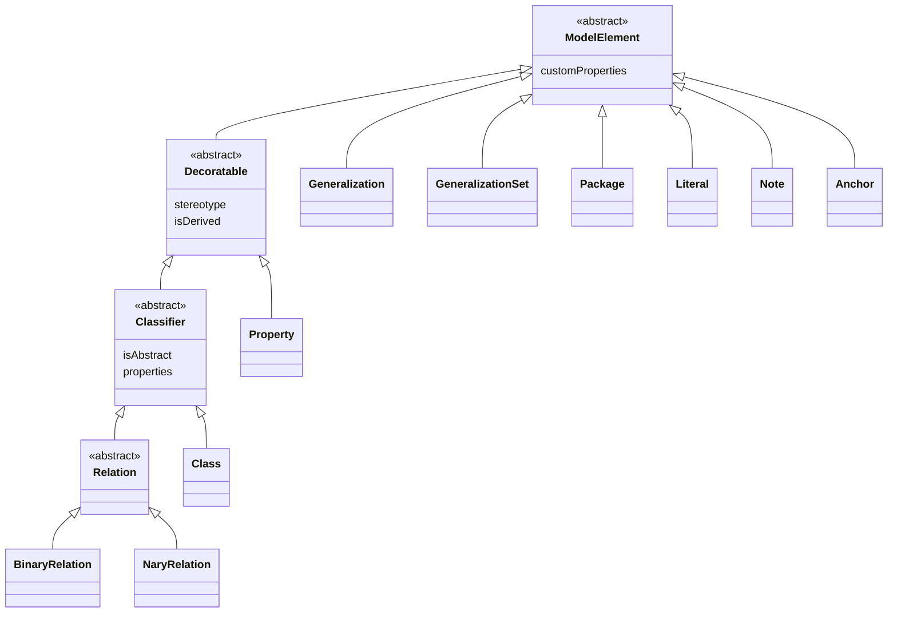

# Abstract Syntax

The **abstract syntax** is the model itself: the elements that carry ontological meaning,
independent of how they are drawn. This section is the reference for every **model element** type;
each type has its own page.

Every page lists a type's **own** properties. In addition, every model element also carries:

- the [identity properties](../document-structure.md#identity-properties) `id`, `created`, and
  `modified` (from `OntoumlElement`);
- the [descriptive properties](../document-structure.md#descriptive-properties) `name`,
  `alternativeNames`, `description`, `editorialNotes`, `creators`, and `contributors` (from
  `NamedElement`); and
- `customProperties` (from `ModelElement`, described below).

Remember that [every property is required](../document-structure.md#every-property-is-required):
values that are absent are written as `null` or `[]`.

## The model-element hierarchy

Concrete model elements specialize a small set of abstract types. The diagram below shows how the
element types documented in this section relate to those abstract types.

## Common to all model elements

Every model element specializes the abstract [`ModelElement`](./model-element.md) type, which
contributes a single property.

| Property | Type | Description |
| --- | --- | --- |
| `customProperties` | `object` or `null` | Custom key-value pairs attached to the element. In UML these correspond to tagged values. |

See [`ModelElement`](./model-element.md) for the full treatment of this shared root.

## Classifiers and properties

Classes, relations, and their properties share two further abstract types.

**`Decoratable`** — a model element that can be decorated with a UFO stereotype. Classes,
relations, and properties are all decoratable. See the full [`Decoratable`](./decoratable.md) page.

| Property | Type | Description |
| --- | --- | --- |
| `stereotype` | `string` or `null` | The element's type according to the Unified Foundational Ontology (UFO), e.g. `"kind"`. |
| `isDerived` | `boolean` or `null` | Whether the element is derived from another (i.e. some other element is its truthmaker). |

**`Classifier`** — a decoratable element (a [class](./class.md) or a [relation](./relation.md))
that defines properties exhibited by its instances. See the full [`Classifier`](./classifier.md)
page.

| Property | Type | Description |
| --- | --- | --- |
| `isAbstract` | `boolean` or `null` | Whether the classifier can have direct instances. An abstract classifier is instantiated only through its non-abstract specializations. |
| `properties` | `id[]` | The [properties](./property.md) contained in the classifier — *attributes* for classes, *relation ends* for relations. For relations this array must be ordered. |

## Packageable elements {#packageable-elements}

A **`PackageableElement`** is any model element that can be grouped into a
[package](./package.md) — that is, the kind of element allowed in a package's `contents`. It is an
abstract union rather than a type with properties of its own; see the full
[`PackageableElement`](./packageable-element.md) page. A packageable element is one of:

- a [`Classifier`](#classifiers-and-properties) — a [class](./class.md) or a [relation](./relation.md);
- a [generalization](./generalization.md);
- a [generalization set](./generalization-set.md);
- an [anchor](./anchor.md);
- a [note](./note.md); or
- a [package](./package.md) itself (allowing packages to nest).

Note that [properties](./property.md) are *not* packageable: they belong to their owning classifier,
not directly to a package.

## Element types

- [ModelElement](./model-element.md) *(abstract; the shared root)*
- [Decoratable](./decoratable.md) *(abstract)*
  - [Classifier](./classifier.md) *(abstract)*
    - [Class](./class.md)
    - [Relation](./relation.md) *(abstract)* — [binary](./binary-relation.md) and [n-ary](./nary-relation.md)
  - [Property](./property.md)
- [Generalization](./generalization.md)
- [Generalization set](./generalization-set.md)
- [Package](./package.md)
- [Packageable element](./packageable-element.md) *(abstract union)*
- [Literal](./literal.md)
- [Note](./note.md)
- [Anchor](./anchor.md)

See also the [Enumerations](../enumerations/index.md) chapter — the standard OntoUML stereotype
vocabulary for decoratable elements (and how custom stereotypes are supported), along with the
`restrictedTo` and `aggregationKind` value sets.
