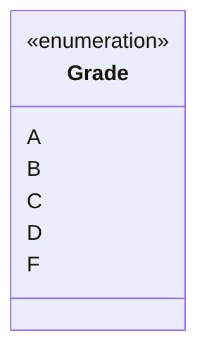

# Literal

A model element that represents a specific value within an enumerated set — for example each letter
of an A–F grading scale, listed in the `literals` of a [`Class`](./class.md) stereotyped as an
enumeration. `Literal` has no properties of its own beyond `type` and the common ones.

| Property | Type | Description |
| --- | --- | --- |
| `type` | `"Literal"` | Discriminator. |

`Literal` also carries the [properties common to all model elements](./index.md).

The example below is the literal `A`, one of the values of the `«enumeration» Grade` class — in UML,
each literal is a value listed in the enumeration's compartment.



```json
{
  "type": "Literal",
  "id": "literal_a",
  "name": { "en": "A" },
  "customProperties": null,
  "created": "2024-09-04",
  "modified": null,
  "alternativeNames": [],
  "description": null,
  "editorialNotes": [],
  "creators": [],
  "contributors": []
}
```
