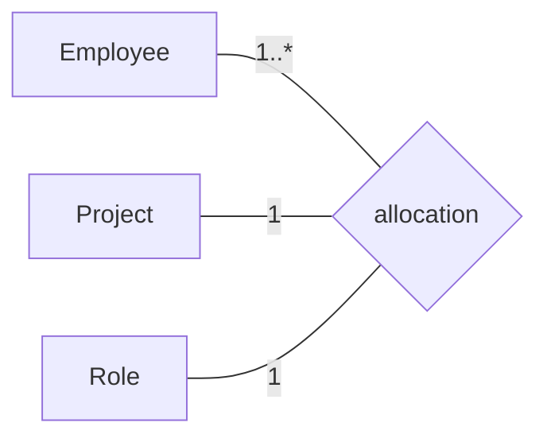

# N-ary relation

A relation that connects **more than two** members. As with binary relations, the ends are
[`Property`](./property.md) elements listed in order in `properties`. In UML an n-ary relation is
drawn as a diamond joined by a plain line to each participating class.

| Property | Type | Description |
| --- | --- | --- |
| `type` | `"NaryRelation"` | Discriminator. |

`NaryRelation` carries the properties of [`Classifier`](./classifier.md) (`isAbstract`,
`properties`), [`Decoratable`](./decoratable.md) (`stereotype`, `isDerived`), and the
[properties common to all model elements](./index.md).

The example below is a ternary `allocation` relation joining `Employee`, `Project`, and `Role`,
with the cardinality of each end shown on its line to the diamond.



```json
{
  "type": "NaryRelation",
  "id": "relation_2",
  "name": { "en": "allocation" },
  "stereotype": null,
  "isDerived": false,
  "isAbstract": false,
  "properties": ["end_employee", "end_project", "end_role"],
  "customProperties": null,
  "created": "2024-09-04",
  "modified": null,
  "alternativeNames": [],
  "description": null,
  "editorialNotes": [],
  "creators": [],
  "contributors": []
}
```

Its three ends are `Property` objects too, again referenced by id and defined separately. Their
cardinalities match the diagram (`1..*` for `end_employee`, `1` for the others):

```json
{
  "type": "Property",
  "id": "end_employee",
  "name": null,
  "stereotype": null,
  "isDerived": false,
  "propertyType": "class_employee",
  "cardinality": "1..*",
  "aggregationKind": null,
  "isOrdered": false,
  "isReadOnly": false,
  "subsettedProperties": [],
  "redefinedProperties": [],
  "customProperties": null,
  "created": "2024-09-04",
  "modified": null,
  "alternativeNames": [],
  "description": null,
  "editorialNotes": [],
  "creators": [],
  "contributors": []
}
```

```json
{
  "type": "Property",
  "id": "end_project",
  "name": null,
  "stereotype": null,
  "isDerived": false,
  "propertyType": "class_project",
  "cardinality": "1",
  "aggregationKind": null,
  "isOrdered": false,
  "isReadOnly": false,
  "subsettedProperties": [],
  "redefinedProperties": [],
  "customProperties": null,
  "created": "2024-09-04",
  "modified": null,
  "alternativeNames": [],
  "description": null,
  "editorialNotes": [],
  "creators": [],
  "contributors": []
}
```

```json
{
  "type": "Property",
  "id": "end_role",
  "name": null,
  "stereotype": null,
  "isDerived": false,
  "propertyType": "class_role",
  "cardinality": "1",
  "aggregationKind": null,
  "isOrdered": false,
  "isReadOnly": false,
  "subsettedProperties": [],
  "redefinedProperties": [],
  "customProperties": null,
  "created": "2024-09-04",
  "modified": null,
  "alternativeNames": [],
  "description": null,
  "editorialNotes": [],
  "creators": [],
  "contributors": []
}
```
