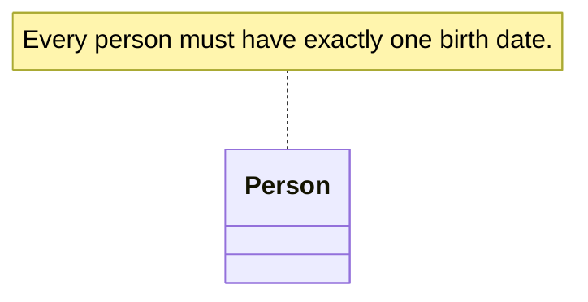

# Note

A model element that carries an annotation about the ontology or some of its elements. A note can
also express a constraint in natural or structured language (e.g. first-order logic or OCL).

| Property | Type | Description |
| --- | --- | --- |
| `type` | `"Note"` | Discriminator. |
| `text` | `languageString` | The contents of the note. |

`Note` also carries the [properties common to all model elements](./index.md).

The example below is a note stating a constraint on `Person`; in UML a note is a dog-eared
rectangle, attached to the element it concerns by an [anchor](./anchor.md) (the dashed connector).



```json
{
  "type": "Note",
  "id": "note_1",
  "name": null,
  "text": { "en": "Every person must have exactly one birth date." },
  "customProperties": null,
  "created": "2024-09-04",
  "modified": null,
  "alternativeNames": [],
  "description": null,
  "editorialNotes": [],
  "creators": [],
  "contributors": []
}
```
