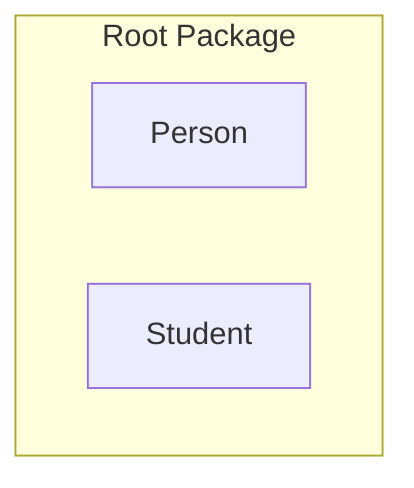

# Package

A model element that groups other model elements ("packageable elements") to modularize an
ontology. The metamodel permits overlapping packages, but ontologies that need a UML
representation should keep packages in a tree structure.

| Property | Type | Description |
| --- | --- | --- |
| `type` | `"Package"` | Discriminator. |
| `contents` | `id[]` | The [packageable elements](./index.md#packageable-elements) grouped by the package. |

`Package` also carries the [properties common to all model elements](./index.md).

The example below is a `Root Package` grouping the classes `Person` and `Student` — the UML package
notation is a tabbed rectangle enclosing its members.



```json
{
  "type": "Package",
  "id": "package_1",
  "name": { "en": "Root Package" },
  "contents": ["class_person", "class_student", "gen_1"],
  "customProperties": null,
  "created": "2024-09-04",
  "modified": null,
  "alternativeNames": [],
  "description": null,
  "editorialNotes": [],
  "creators": [],
  "contributors": []
}
```
