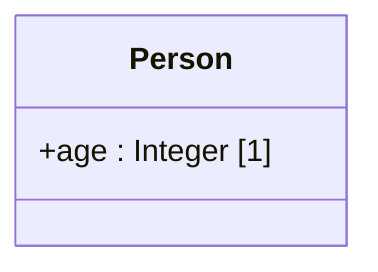

# Property

A **decoratable** element that represents either an *attribute* of a class or one *end* of a
relation. For example, the attribute `age` of `Person`, or the ends of the binary relation
`studies in` connecting `Student` and `University`.

| Property | Type | Description |
| --- | --- | --- |
| `type` | `"Property"` | Discriminator. |
| `propertyType` | `id` or `null` | The classifier instantiated by the values assigned to the property. |
| `cardinality` | `string` or `null` | The cardinality, e.g. `"1"`, `"0..*"`, `"1..5"`. |
| `aggregationKind` | `enum` or `null` | For relation ends, whether the end is a whole in a parthood relation: `"COMPOSITE"`, `"SHARED"`, or `"NONE"`. `null` is interpreted as `"NONE"`. |
| `isOrdered` | `boolean` or `null` | Whether the order of the property's assignments is meaningful (only relevant when the maximum cardinality exceeds one). |
| `isReadOnly` | `boolean` or `null` | Whether the property's assignments are immutable. |
| `subsettedProperties` | `id[]` | Properties (relation ends) that this property subsets. |
| `redefinedProperties` | `id[]` | Properties (relation ends) that this property redefines. |

`Property` also carries the properties of [`Decoratable`](./index.md#classifiers-and-properties)
(`stereotype`, `isDerived`) and the [properties common to all model elements](./index.md).

By convention, `cardinality` matches `^\d+(\.\.(\d+|\*))?$` — a lower bound, optionally followed by
`..` and an upper bound (`*` denotes unbounded). The pattern is not enforced, so free-form ranges
such as `a..b` are also accepted.

The example below is the attribute `age`, of type `Integer` with cardinality `1`, held by the class
`Person` — shown as the property compartment of the class box.



```json
{
  "type": "Property",
  "id": "prop_age",
  "name": { "en": "age" },
  "stereotype": null,
  "isDerived": false,
  "propertyType": "class_integer",
  "cardinality": "1",
  "aggregationKind": null,
  "isOrdered": false,
  "isReadOnly": false,
  "subsettedProperties": [],
  "redefinedProperties": [],
  "customProperties": null,
  "created": "2024-09-04",
  "modified": null,
  "alternativeNames": [],
  "description": null,
  "editorialNotes": [],
  "creators": [],
  "contributors": []
}
```

## Subsetting and redefinition {#subsetting-redefinition}

A relation end can refine an end inherited from a more general relation, in two ways:

- **Subsetting** (`subsettedProperties`) — the values of this end are always a *subset* of the
  values of the end it subsets. In UML this is annotated `{subsets parent}`.
- **Redefinition** (`redefinedProperties`) — this end *replaces* the end it redefines in the
  context of the specialized classifier, typically tightening its cardinality or retyping it. In
  UML this is annotated `{redefines parent}`.

Suppose a general relation `parenthood` connects `Person` to `Person` through an end `end_parent`
(cardinality `0..2`). A specialized relation `motherhood` between `Person` and `Woman` **subsets**
that end — every mother is one of the parents — while narrowing the cardinality to `0..1`:

```json
{
  "type": "Property",
  "id": "end_mother",
  "name": { "en": "mother" },
  "stereotype": null,
  "isDerived": false,
  "propertyType": "class_woman",
  "cardinality": "0..1",
  "aggregationKind": null,
  "isOrdered": false,
  "isReadOnly": false,
  "subsettedProperties": ["end_parent"],
  "redefinedProperties": [],
  "customProperties": null,
  "created": "2024-09-04",
  "modified": null,
  "alternativeNames": [],
  "description": null,
  "editorialNotes": [],
  "creators": [],
  "contributors": []
}
```

An end that instead **redefines** `end_parent` — for example on a relation specialized for
`Orphan`, forcing the parent cardinality to `0` — lists it in `redefinedProperties`:

```json
{
  "type": "Property",
  "id": "end_orphan_parent",
  "name": null,
  "stereotype": null,
  "isDerived": false,
  "propertyType": "class_person",
  "cardinality": "0",
  "aggregationKind": null,
  "isOrdered": false,
  "isReadOnly": false,
  "subsettedProperties": [],
  "redefinedProperties": ["end_parent"],
  "customProperties": null,
  "created": "2024-09-04",
  "modified": null,
  "alternativeNames": [],
  "description": null,
  "editorialNotes": [],
  "creators": [],
  "contributors": []
}
```
