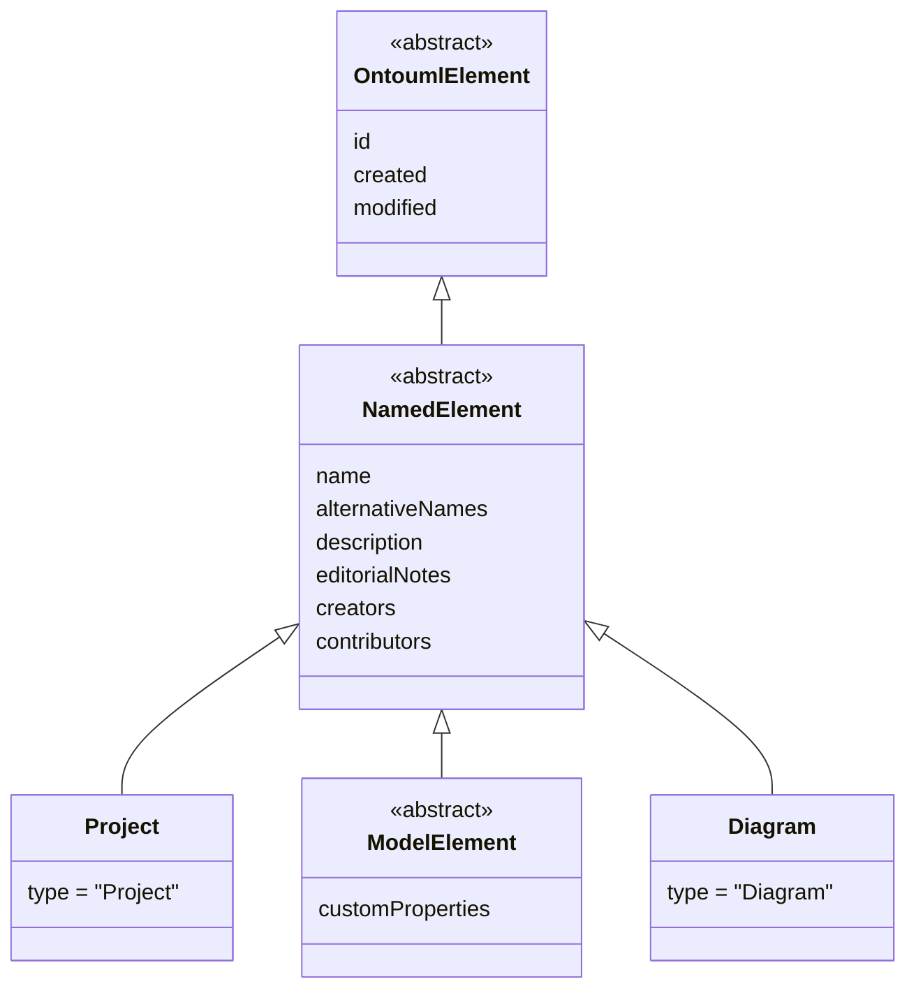

# Structural Elements

Every element in an OntoUML serialization is built on a small **structural backbone**: a chain of
abstract types that factor out the properties shared across the whole language. Whatever an element
ultimately *is* — a [`Project`](./project.md), a [class](../abstract-syntax/class.md), a
[diagram](../concrete-syntax/diagram.md) — it first carries an identity, and (almost always) a name
and other descriptive information.

That backbone is the chain
`OntoumlElement → NamedElement → { Project, ModelElement, Diagram }`:

- [`OntoumlElement`](./ontouml-element.md) is the root of everything. It contributes the
  [identity properties](../document-structure.md#identity-properties) `id`, `created`, and
  `modified`.
- [`NamedElement`](./named-element.md) adds the six
  [descriptive properties](../document-structure.md#descriptive-properties) — `name`,
  `alternativeNames`, `description`, `editorialNotes`, `creators`, and `contributors`.
- Its concrete/abstract descendants are the [`Project`](./project.md) container, the abstract
  [`ModelElement`](./model-element.md) branch (all of the [abstract syntax](../abstract-syntax/index.md)),
  and the [`Diagram`](../concrete-syntax/diagram.md) (part of the
  [concrete syntax](../concrete-syntax/index.md)).

The pages in this section document the structural types themselves:

- [`OntoumlElement`](./ontouml-element.md) — abstract; the identity root of every element.
- [`NamedElement`](./named-element.md) — abstract; adds the descriptive properties.
- [`Project`](./project.md) — concrete; the container that aggregates an entire ontology.
- [`ModelElement`](./model-element.md) — abstract; the root of the abstract syntax, adding
  `customProperties`.

The third named descendant, `Diagram`, belongs to the concrete syntax and is documented under
[`../concrete-syntax/diagram.md`](../concrete-syntax/diagram.md).

For a narrative walkthrough of the same material — the type discriminator, references by `id`, and
the required-property rule — see [Document Structure](../document-structure.md).
