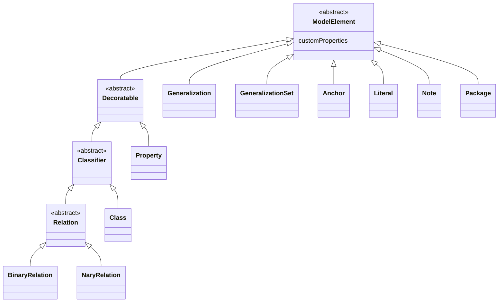

# ModelElement

A `ModelElement` is a [`NamedElement`](./named-element.md) that represents an element of the
language's **abstract syntax** — a class, a relation, a generalization, and so on. It is an
**abstract** grouping that never appears directly in a document (it has no `type` value of its own);
it only contributes the single property below to its many subtypes.

| Property | Type | Description |
| --- | --- | --- |
| `customProperties` | `object` or `null` | Custom key-value pairs attached to the element. In UML these correspond to tagged values. |

`ModelElement` also carries the [identity properties](../document-structure.md#identity-properties)
`id`, `created`, and `modified` from [`OntoumlElement`](./ontouml-element.md), and the
[descriptive properties](../document-structure.md#descriptive-properties) `name`,
`alternativeNames`, `description`, `editorialNotes`, `creators`, and `contributors` from
[`NamedElement`](./named-element.md). Because
[every property is required](../document-structure.md#every-property-is-required),
`customProperties` is always present, written as `null` when the element carries no custom
key-value pairs.

`customProperties` is the schema's counterpart to UML **tagged values**: a free-form bag of
extra key-value data that a tool or modeler can attach to any model element without extending the
metamodel.

## Subtypes

Every model element in the [abstract syntax](../abstract-syntax/index.md) specializes
`ModelElement`. Its direct descendants are:

- [`Generalization`](../abstract-syntax/generalization.md)
- [`GeneralizationSet`](../abstract-syntax/generalization-set.md)
- [`Anchor`](../abstract-syntax/anchor.md)
- [`Literal`](../abstract-syntax/literal.md)
- [`Note`](../abstract-syntax/note.md)
- [`Package`](../abstract-syntax/package.md)
- `Decoratable` — the abstract branch of elements that can carry a UFO stereotype, comprising
  [`Property`](../abstract-syntax/property.md) and `Classifier`
  ([`Class`](../abstract-syntax/class.md) and `Relation` →
  [binary](../abstract-syntax/relation.md#binary-relation) and
  [n-ary](../abstract-syntax/relation.md#nary-relation) relations).



## Shared properties

Since `ModelElement` is abstract, it is never serialized on its own. Its `customProperties` appears
inside every model element, alongside the identity and descriptive blocks:

```json
{
  "id": "class_1",
  "created": "2024-09-03",
  "modified": null,
  "name": { "en": "Person" },
  "alternativeNames": [],
  "description": null,
  "editorialNotes": [],
  "creators": [],
  "contributors": [],
  "customProperties": null
}
```

See the [Abstract Syntax](../abstract-syntax/index.md) reference — for example
[`Class`](../abstract-syntax/class.md) — for complete, serializable objects that embed this block.
